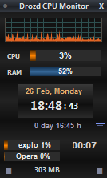

# AHK-Scripts

[Drozdman. AHK forum](https://www.autohotkey.com/boards/memberlist.php?mode=viewprofile&u=65650)
[Quick Notes. RichEdit version. AHK forum](https://www.autohotkey.com/boards/viewtopic.php?f=6&t=53021)
[Traditional clock gadget with timer, periodic alarm (Gdip). AHK forum](https://www.autohotkey.com/boards/viewtopic.php?f=6&t=48268)
[Network monitor with history graph, total usage. AHK forum](https://www.autohotkey.com/boards/viewtopic.php?f=6&t=45628)
[CPU monitor with history graph. AHK forum](https://www.autohotkey.com/boards/viewtopic.php?f=6&t=45630)
[Toolbars for 'Windows Explorer', for 'Open/Save As' dialogs. AHK forum](https://www.autohotkey.com/boards/viewtopic.php?f=6&t=52369)
[Scripts management. AHK process list. AHK forum](https://www.autohotkey.com/boards/viewtopic.php?f=6&t=55209)
[DrozdTool - buttons for lists of 'favorites' in Notepad++, SciTE, Notepad2. AHK forum](https://www.autohotkey.com/boards/viewtopic.php?f=6&t=61094)
[Sets of hotkeys. Old clipboards.AHK forum](https://www.autohotkey.com/boards/viewtopic.php?f=6&t=51064)
[Alarm Timer. Stopper. Quick Notes. Snipping Tool.AHK forum](https://www.autohotkey.com/boards/viewtopic.php?f=6&t=45857)
['Window on top' button (SetWinEventHook). AHK forum](https://www.autohotkey.com/boards/viewtopic.php?f=6&t=52367)

